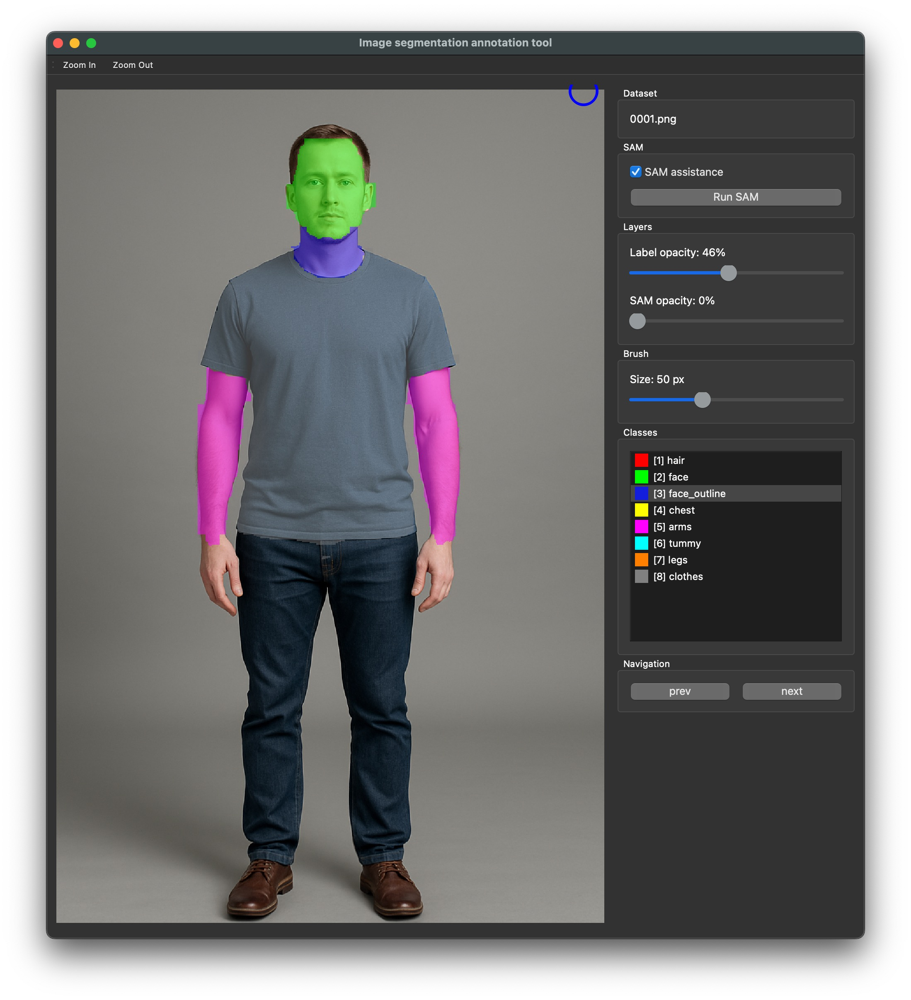

# Image Segmentation Annotation Tool

A simple PyQt5-based GUI tool for image segmentation annotation. Designed for personal use.



## Setup

This project uses `uv` for dependency management. I assume `asdf` to prepare python and uv.

```bash
asdf plugin add python    # skip if you've done this once
asdf plugin add uv        # skip if you've done this once
asdf install              
```

```bash
uv venv
uv install
```

## Run

Activate the virtual environment, then run:

```bash
source .venv/bin/activate
python .
```

## Work folder structure

Under `/work`, you need to place a `classes.json` file.
Then, create one or more workset folders (e.g. `workset`) inside it.
Each workset should contain your input images in an `images/` folder.

Example `classes.json`:

```json:classes.json
{
    "classes": [
        { "id": 1, "name": "hair", "color": "#FF0000" },
        { "id": 2, "name": "face", "color": "#00FF00" }
    ]
}
```

where:

- `id` field must coincide with number keys on keyboard, so start with 1 (not 0). Any number of classes allowed, but only first 9 have their shortcuts.
- `name` field is arbitrary and used only for display in GUI
- `color` field specifies the color this class would be displayed in GUI and encoded in output label `.png`

```

── work
   ├── classes.json
   └── {workset}
       ├── images
       |   ├── 000001.png
       |   ├── 000002.png
       |   └── ...
       ├── labels (automatically created)
       |   ├── 000001.png
       |   ├── 000002.png
       |   └── ...
       ├── sam (automatically created)
       |   ├── 000001.png
       |   ├── 000002.png
       |   └── ...
   └── {another_workset}
       ├── ...

```

Image filenames can be arbitrary (e.g. .jpg or .png), as long as they are supported by Python.

## Usage

See the implementation of `src/main_window.py`.

## Acknowledgements

This project is originally based on  
[SAM Annotation Tool (SAMAT)](https://github.com/Divelix/samat) by Sergei Sergienko,  
licensed under the MIT License.
